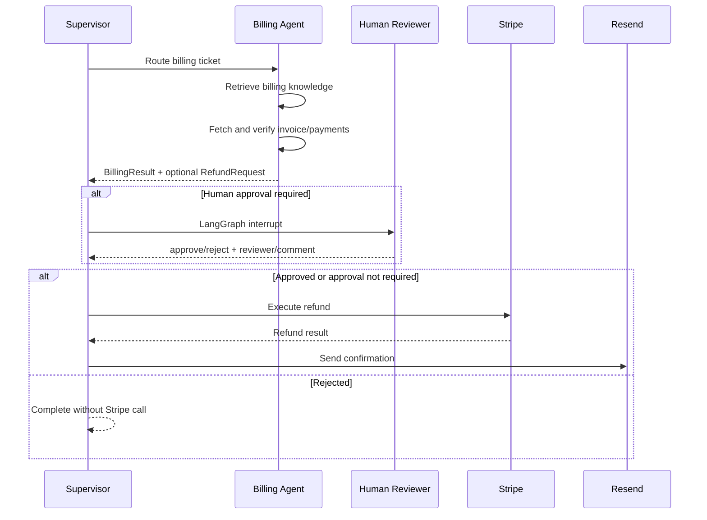

# Ticket Flow architecture

## Workflow ownership

| Component | Owns | Does not own |
|---|---|---|
| Supervisor | Intent, priority, sentiment, summary, route | Ticket resolution |
| Billing Agent | Investigation and `BillingResult` decision | Approval or execution results |
| Approval node | Reviewer decision and audit fields | Stripe execution |
| Refund execution node | Stripe tool invocation and result | Agent reasoning |
| Confirmation node | Customer notification result | Refund authorization |
| Technical Agent | Grounded `TechnicalResult` | External system changes |
| Returns Agent | Policy-grounded `ReturnsResult` | Warehouse or carrier changes |
| Escalation Agent | Typed human handoff | Resolution by the human queue |

## Billing sequence



## GraphState

`GraphState` is a Pydantic model. Important fields are:

- `ticket`
- `supervisor_decision`
- `billing_result`
- `technical_result`
- `pending_refund`
- `approval_status`, `approval_reviewer`, `approval_comment`
- `refund_result`, `confirmation_result`
- `workflow_status`, `retry_count`, `error_message`

LangGraph may return a dictionary. Use `GraphState.model_validate(result)` when
the caller needs a typed state object.

## HITL invariants

1. A proposed refund is copied to `GraphState.pending_refund`.
2. Required approval sets `ApprovalStatus.PENDING`.
3. `refund_approval_node` calls `interrupt()` before any Stripe invocation.
4. Resume uses `Command(resume=...)` and the original `thread_id`.
5. Only `APPROVED` or `NOT_REQUIRED` reaches refund execution.
6. `REJECTED` terminates without calling Stripe.
7. Only a successful refund reaches confirmation.

## Technical path

The Technical Agent deliberately stays small for v1:

```text
Ticket -> technical Chroma retrieval -> structured Groq call -> TechnicalResult
```

Supported categories are login issues, password reset, network connectivity,
service outage, API timeout, and other. The agent has no mutating tools.

## Runtime and persistence

- `CHECKPOINTER_BACKEND=memory` is intended for tests and local demos.
- `CHECKPOINTER_BACKEND=sqlite` persists resumable graph state at
  `CHECKPOINT_DB_PATH`.
- Checkpoint deserialization allowlists the project's typed state/schema
  modules.
- `PERSIST_REFUNDS=true` writes refund proposal, approval, processing, success,
  failure, and cancellation states to Supabase.
- `DELIVER_ESCALATIONS=true` sends escalation handoffs to the configured
  Zendesk-compatible endpoint.

## Further production follow-ups

- Use a managed Postgres/Redis checkpointer for horizontally scaled workers.
- Add authentication and tenant-aware API authorization.
- Add dead-letter queue monitoring and alerting.
- Run load, security, and disaster-recovery tests before production traffic.
